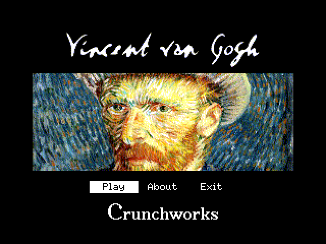
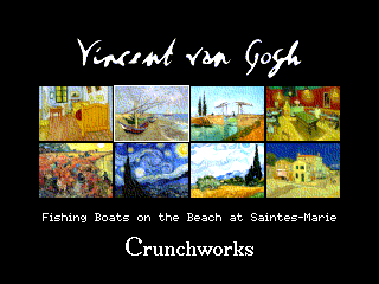
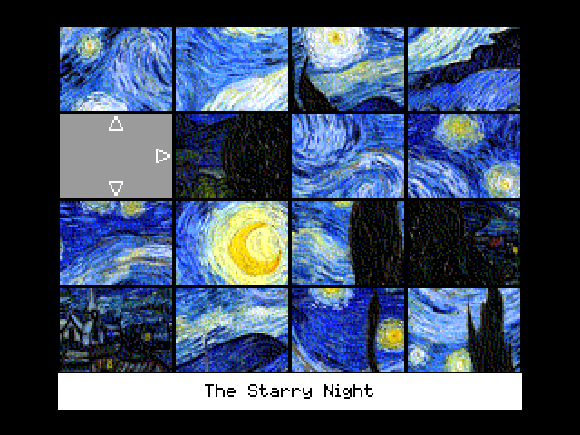
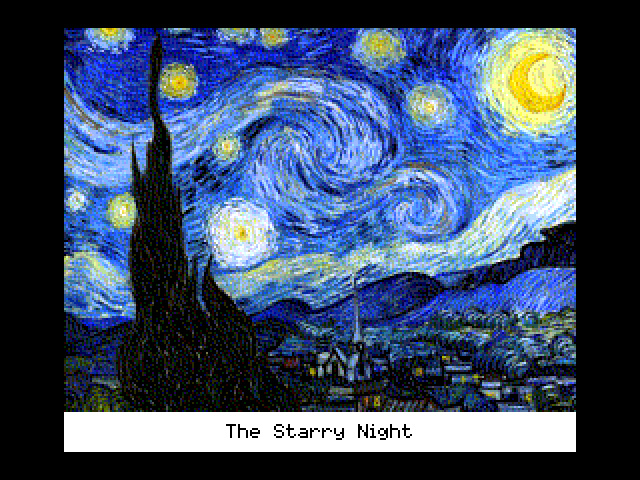

PicPuzzle
=========

PicPuzzle is a puzzle game written using MSX-BASIC and
[MSX-BASIC Kun](https://www.generation-msx.nl/software/ascii-corporation/msx-basic-kun/721/)
as well. It's a kind of [15 Number](https://en.wikipedia.org/wiki/15_Puzzle)
game, something I used to play when I was a kid, but instead of squares
labeled with numbers I decided to play using pictures from
[Vincent van Gogh](https://en.wikipedia.org/wiki/Vincent_van_Gogh)
just like in jigsaws.

I'm using eight paintings from the artist:

- [Bedroom in Arles](https://en.wikipedia.org/wiki/Bedroom_in_Arles)
- [Fishing Boats on the Beach at Saintes-Marie](https://en.wikipedia.org/wiki/Saintes-Maries_(Van_Gogh_series))
- [Langlois Bridge in Arles](https://en.wikipedia.org/wiki/Langlois_Bridge_at_Arles)
- [The Night Café](https://en.wikipedia.org/wiki/The_Night_Caf%C3%A9)
- [The Red Vineyard](https://en.wikipedia.org/wiki/The_Red_Vineyard)
- [The Starry Night](https://en.wikipedia.org/wiki/The_Starry_Night)
- [Wheat Field with Cypresses](https://en.wikipedia.org/wiki/Wheat_Field_with_Cypresses)
- [The Yellow House](https://en.wikipedia.org/wiki/The_Yellow_House)

Game
----
This game uses MSX-BASIC Kun to improve the performance.

### Requirements
This game requires at least a MSX2 computer with:
- 64 KiB of RAM
- 128 KiB of VRAM
- One 720 KiB DD disk drive (or any kind of compatible with MSX-Disk BASIC
  mass-storage device).

This version doesn't support joysticks.

### Running
For disk drives, just put the game's disk in the drive, turn the computer
on, and wait while it is automatically executed. For harddisks, memory
cards or memory sticks, simply copy all files to it and run
`BASIC AUTOEXEC.BAS` on MSX-DOS or run `RUN "AUTOEXEC.BAS"` on MSX-BASIC.

You can also
[run](https://webmsx.org?MACHINE=MSX2A&DISK=https://github.com/plainspooky/pic-puzzle-msx/releases/download/v0.1/PicPuzzle.2023.Crunchworks.zip)
it using [WebMSX](https://github.com/ppeccin/WebMSX).

### Playing
Use the arrow keys to select and `«ENTER»` to select.During the puzzle
solving screen you can press `«SPACE»` to take a look in the picture to
compare your progress or `«ESC»` twice to go back to the main menu.

Screenshots
-----------

### Main Menu

### Picture Selection

### The Puzzle

### Picture Preview

